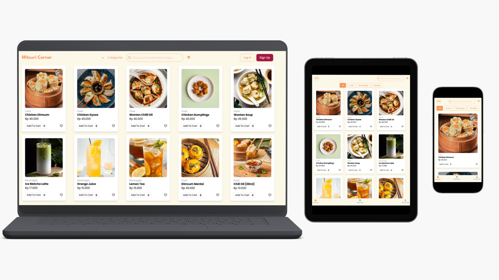

## Overview

Mitsuri Corner is a React-based e-commerce frontend that simulates a real-world online shopping experience, including product browsing, cart management, and order flow.  
This project focuses on scalable state management and clean UI architecture for production-like applications.

## Key Features

- Product browsing with category and search
- User authentication & profile management
- Address management for checkout process
- Shopping cart management (add, remove, update quantity)
- Order flow simulation
- Global state management using Redux Toolkit
- Responsive UI with Tailwind CSS

## Tech Stack

The application is built using:

- Laravel (Backend)
- React (Frontend)
- Redux Toolkit (State Management)
- Tailwind CSS (Styling)

## Getting Started

Follow the steps below to get started with the application:

- git clone https://github.com/taripuspitasari/react-ecommerce-app.git
- cd ecommerce-app
- npm install
- npm run dev

