# Mitsuri Dimsum

Mitsuri Dimsum is an e-commerce platform for selling delicious chicken dim sum. This web application allows users to browse products, add them to their cart, manage their profile, and place orders. The platform integrates with the Stockmate inventory system to manage products and transactions seamlessly.

## Tech Stack

The application is built using:

- Laravel (Backend)
- React (Frontend)
- Redux (State Management)
- Tailwind CSS (Styling)
- Font Awesome (Icons)

## Getting Started

Follow the steps below to get started with the application:

- git clone https://github.com/taripuspitasari/ecommerce-app.git
- cd ecommerce-app
- npm install
- npm run dev

  
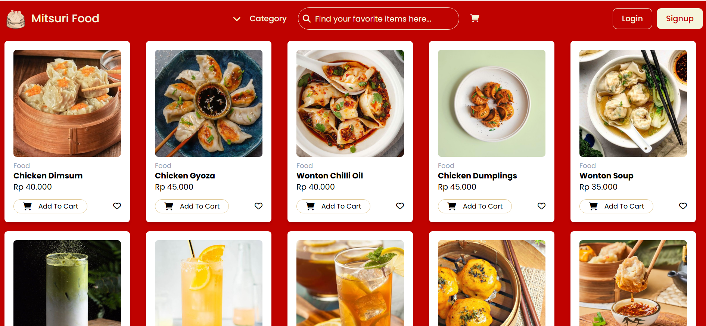  
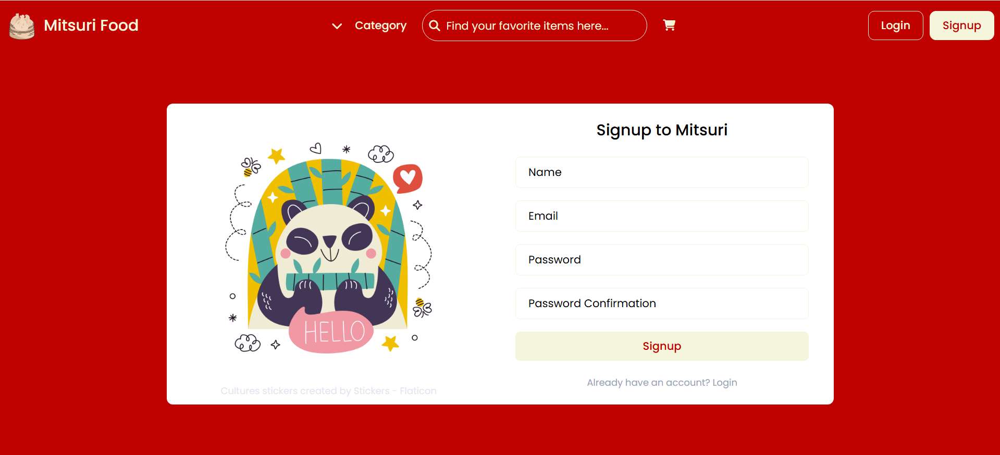  
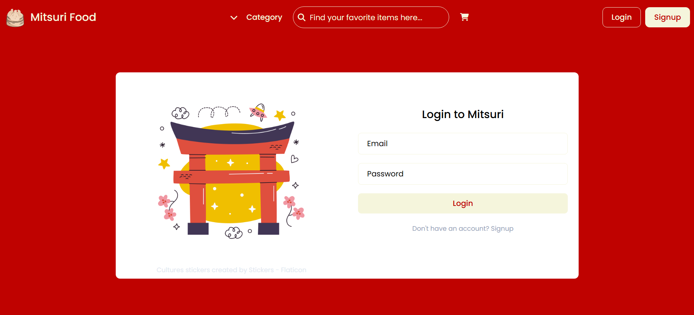  
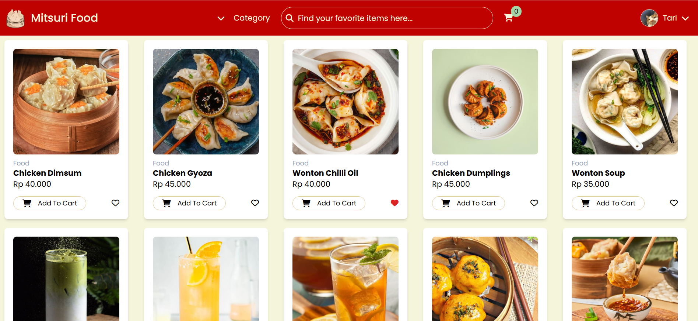  
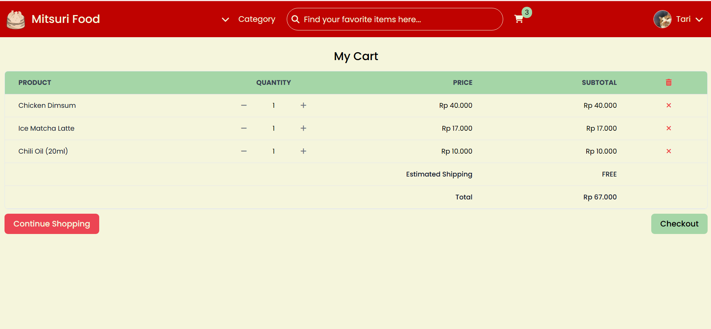  
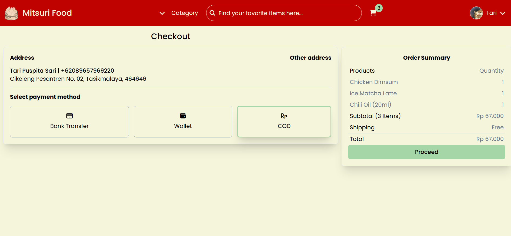  
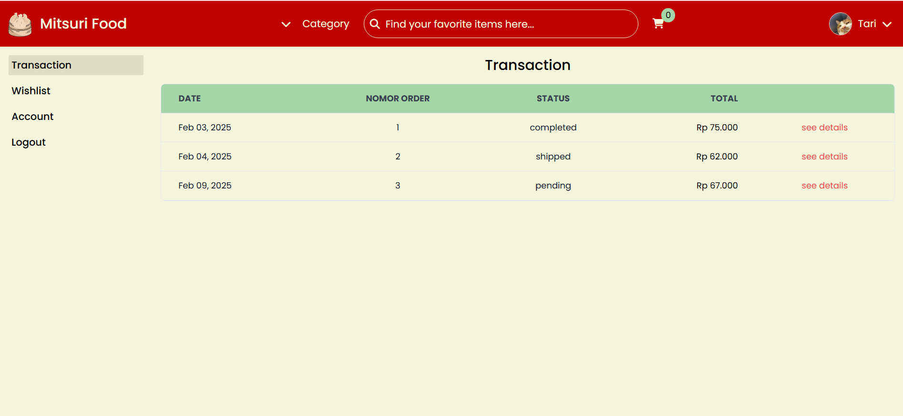  
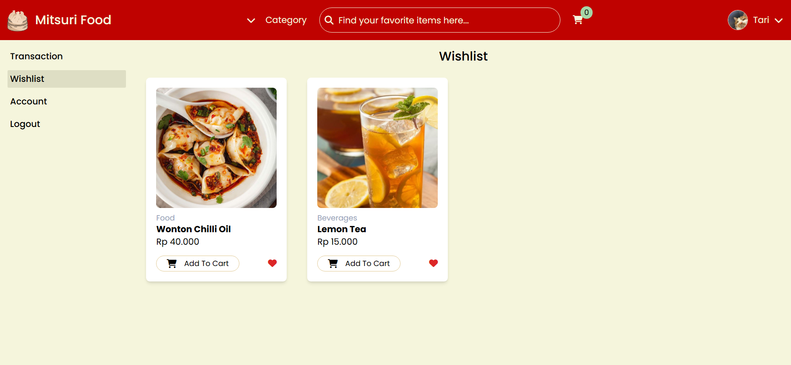  
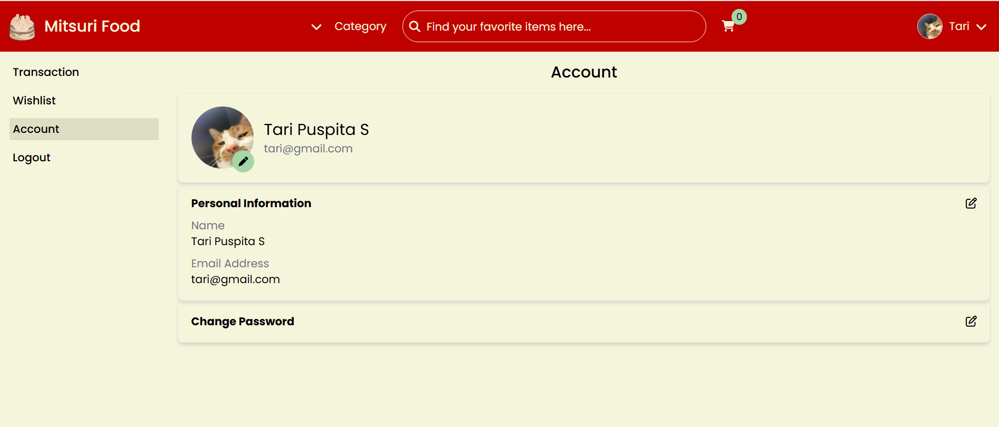  
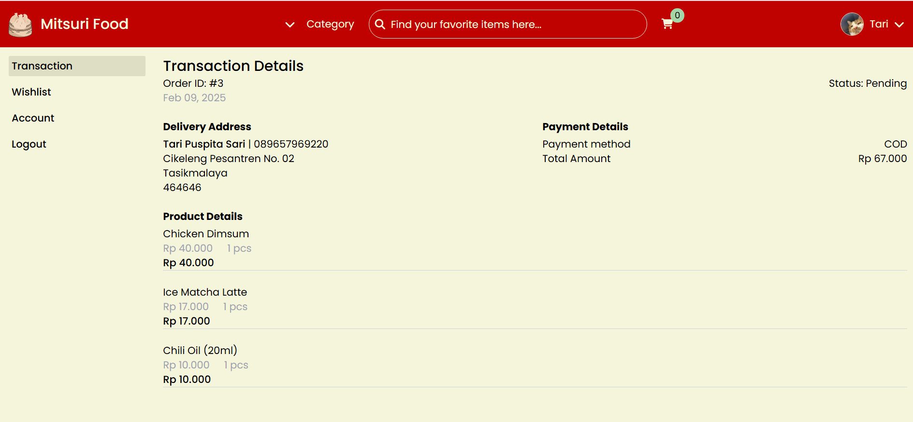  
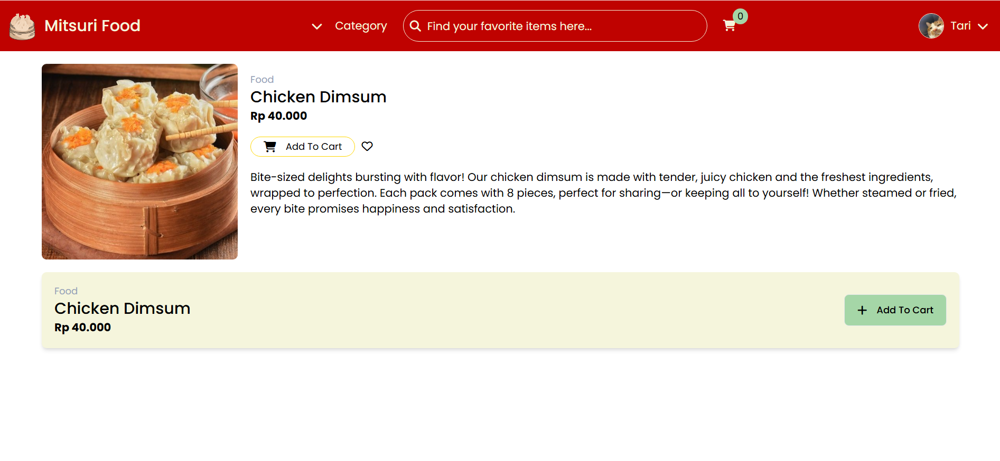  
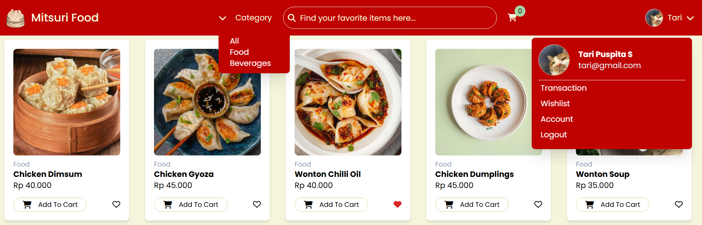
